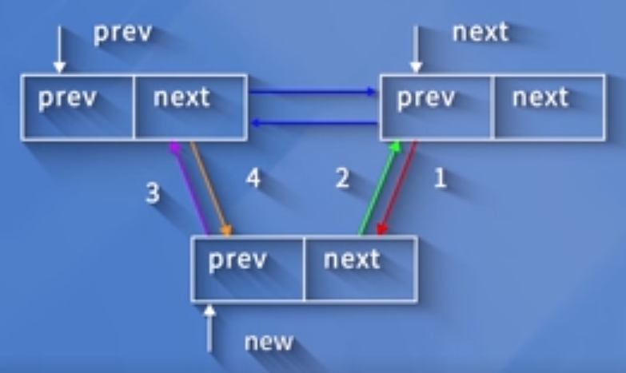
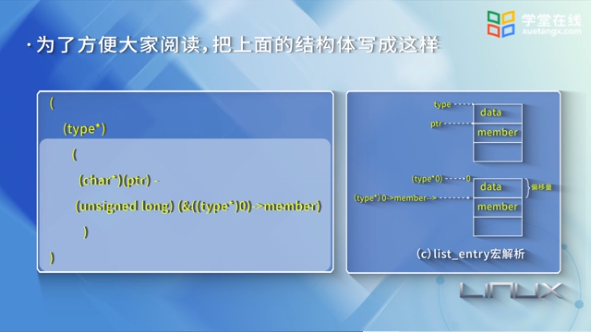
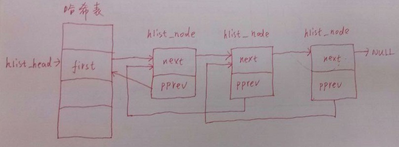
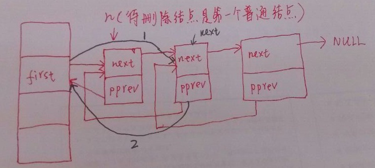
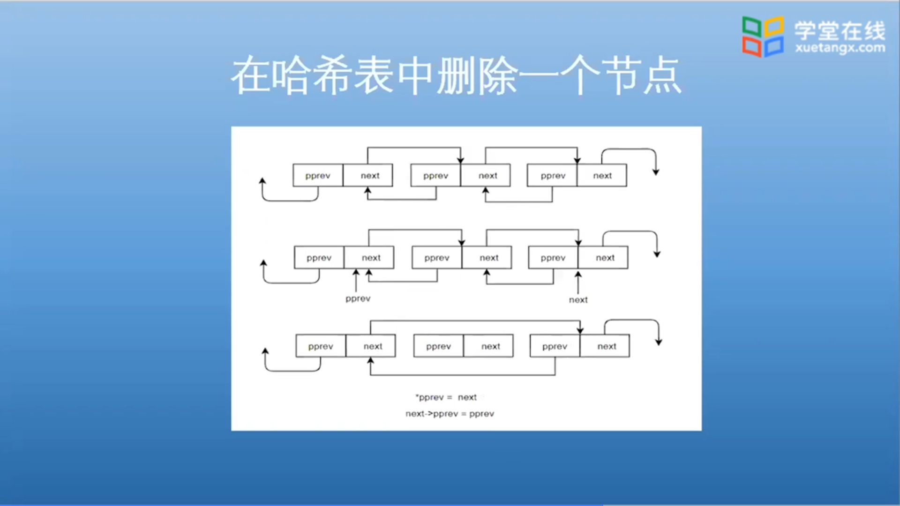

## Linux 内核模块编程入门

### C 代码范例：

```c
#include <linux/module.h>
#include <linux/kernel.h>
#include <linux/init.h>

/* *
 * 模块的初始化函数 lkp_init()
 * __init 是用于初始化的修饰符
 * */
static int __init lkp_init(void) {
    printk("<1>Hello,world!from the kernel space...\n");
    return 0;
}

/* 模块的退出和清理函数 */
static void __exit lkp_exit(void) {
    printk("<1>Goodbye,world!leaving kernel space...\n");
}

module_init(lkp_init);
module_exit(lkp_exit);

/* 模块的许可证声明 */
MODULE_LICENSE("GPL");
```

### makefile 范例

```makefile
obj-m := module_example.o                                    # 产生 module_example 模块的目标文件
CURRENT_PATH := $(shell pwd)                                 # 模块所在的当前路径
LINUX_KERNEL := $(shell uname -r)                            # linux 内核源代码的当前版本
LINUX_KERNEL_PATH := /usr/src/linux-headers-$(LINUX_KERNEL)  # linux 内核源代码的绝对路径

all:
	make -C $(LINUX_KERNEL_PATH) M=$(CURRENT_PATH) modules   # 编译模块
clean:
	make -C $(LINUX_KERNEL_PATH) M=$(CURRENT_PATH) clean     # 清理模块
```

#### 含义

obj-m := 这个赋值语句的含义是说明要使用目标文件 module_example.o 建立一个模块，最后生成的模块名为 module_example.ko

o 文件是经过编译和汇编，而没有经过链接的中间文件

注：makefile 文件中，若某一行的命令，则它必须以一个 Tab 键开头

### 命令一览

#### 模块插入命令

```bash
insmod module_example.ko
```

#### 模块删除命令

```bash
rmmod module_example
```

## Linux 内核模块与 C 应用的对比

|              | C语言应用程序 | 内核模块程序     |
| ------------ | ------------- | ---------------- |
| **使用函数** | Libc 库       | 内核函数         |
| **运行空间** | 用户空间      | 内核空间         |
| **运行权限** | 普通用户      | 超级用户         |
| **入口函数** | main()        | module_init()    |
| **出口函数** | exit()        | module_cleanup() |
| **编译**     | gcc -c        | make             |
| **连接**     | gcc           | insmod           |
| **运行**     | 直接运行      | insmod           |
| **调试**     | gdb           | kgdb             |

## Linux 内核源码入门 -- 双链表

在 C 语言中，一个基本的双向链表定义如下：

```c
struct my_list {
    void *mydata;
    struct my_list *next;
    struct my_list *prev;
};
```

### Linux 内核中链表的定义和使用

Linux 内核对链表的实现方式雨中不要，在链表中并不包含数据，其具体的定义如下：

```c
struct list_head {
    struct list_head *next, *prev;
}
```

这个链表结构常常被嵌入到其他结构中，比如：

```c
struxt my_list {
    void *mydata;
    struct list_head list;
};
```

说明：list 域隐藏了链表的指针特性

以 `struct list_head` 为基本对象，可以对链表进行插入、删除、合并以及遍历等各种操作，`这些操作位于内核的头文件 list.h 中`。

### 链表的声明和初始化

内核代码 list.h 中定义了两个宏

```c
/* 仅初始化 */
#define LIST_HEAD_INIT(name) { &(name), &(name)}
/* 声明并初始化 */
#define LIST_HEAD(name) struct list_head name = LIST_HEAD_INIT(name)
```

```c
static inline int list_empty(const struct list_head *head) {
    return head->next == head;
}
```

### 链表的插入

在链表中增加一个节点

include/linux/list.h

```c
static inline void list_add();
static inline void list_add_tail();
```

list_add() 和 list_add_tail() 均调用 ___list_add()

```c
static inline void __list_add(struct list_head *new, struct list_head *prev, struct list_head *next) {
    next->prev = new;
    new->next = next;
    new->prev = prev;
    prev->next = new;
}
```



```c
static inline void __list_add_tail(struct list_head *new, struct list_head *head) {
    __list_add(new, head->prev, head);
}
```

__list_add_tail() 函数向指定链表的 head 节点前插入 new 节点。

**说明：关于 static inline 关键字**

static 加载函数前表示这个函数是静态函数，也就是说函数的作用域仅限于本文件，所以说 static 具有信息隐藏的作用

inline 加在函数前说明这个函数对编译程序是可见的，也就是说编译程序在调用这个函数的时候就立即展开这个函数

### 链表的遍历

```c
#define list_for_each(pos, head) \
    for(pos = (head)->next; pos != (head);\
        pos = pos->next)
```

当头尾相遇的时候我们的遍历就结束

这个遍历里面所得到的链表知识找到一个节点在链表中的偏移位置

如图所示：


**那么如何通过这个偏移获得节点的起始地址，从而引用节点中的各个域呢**

```c
#define list_entry(ptr, type, member) \
    ((type *)((char *)(ptr) - (unsigned long)(&((type *)0)->member)))
```

ptr 是个指针，它是成员 member 所在的位置

type 代表这个结构体的类型

member 是这个结构体的一个成员

通过这个宏，我们最后可以获得这个节点的起始地址



在这个宏的外面，是一个强制类型转换，在里面实际上是一个减法操作

这个减法操作就是绝对地址减去这个偏移量得到的，就是这个节点的起始地址

**绝对地址是如何获得的**

首先我们将 ptr 强制转换成一个 char 类型，实际上就是这个指针的绝对的位置

**如何求 member 成员的偏移量**

我们给它前面强制转换零，从零开始求它的位置

**函数作用**

那么这样的话求出来的一个是绝对地址 一个是偏移量

二者一减的话，我们就得到这个节点的起始地址

## 源码分析 -- 内核中的哈希表

解决哈希表冲突的常见方法：开放寻址法、再散列法、链地址法

**链地址法的基本思想**

将具有相同哈希地址的记录链成一个链表，m 个哈希地址就有 m 个链表

然后用一个数组，将这 m 个链表的头节点存储起来，形成一个动态的结构

内核中的 hlist 就是内核为我们提供的一个用于实现哈希表链地址法的一个数据结构

### 哈希表的定义和使用

```c
struct hlist_head {
    struct hlist_node *first;
}

struct hlist_node {
    struct hlist_node *next, **pprev;
}
```

哈希表结构如图



### 哈希表的声明和初始化

首先是几个宏定义

```c
#define HLIST_HEAD_INIT { .first = NULL }
#define HLIST_HEAD(name) struct hlist_head name = { .first = NULL }
#define INIT_HLIST_HEAD(ptr) ((ptr)->first = NULL)
#define INIT_HLIST_NODE(ptr) ((ptr)->next = NULL, (ptr)->pprev = NULL)
```

可以看出前三个宏是对于头节点进行初始化的宏

第四个宏是对于 hlist_node 节点进行初始化的宏

然后是几个函数定义

**hlist_unhashed**

```c
static __inline__ int hlist_unhashed(const struct hlist_node *h) {
    return !h->pprev;
}
```

这个函数是用于判断一个 hlist_node 型的节点是否经过哈希

如果该节点没有经过哈希，那么其指针域 pprev 应当是初始化时候赋予的空，那么其返回的值就应当为 true 了

**hlist_empty**

```c
static __inline__ int hlist_empty(const struct hlist_head *h) {
    return !h->first;
}
```

它需要传入的参数是一个 hlist_head 型的节点

该函数是对于一个头节点，判断其所链接的链表是否为空的

如果该头节点所链的链表为空，那么自然其 first 指针域就应当为空，返回值就是 true 了

**__hlist_del**

```c
static __inline__ int __hlist_del(struct hlist_node *n) {
    struct hlist_node *next = n->next;
    struct hlist_node **pprev = n->pprev;
    *pprev = next;
    if(next) next->pprev = pprev;
}
```

```
假设 next 为 next_0，pprev 为 pprev_0，且
next_0 为一个指针，&next_0 为指针的地址，next_0 为指针的值
那么经过第 2 行，next_0 = n->next
经过第 3 行，pprev_0 = n->pprev
经过第 4 行，因为第二个节点初始化时 pprev_0 = &first，所以 *pprev_0 = next，相当于 first = next
即将 hash 桶的头节点指针指向原来的第 2 个节点，如下图中的黑线 1
第 5 行判断下一个（以 first 节点举例的话就是第二个）节点是否为空
第 6 行说明假使第二个节点不为空，那么将第二个节点的 pprev 域设置为头节点 first 域的地址，如下图中的黑线 2
```





n 不是第一个普通节点的话道理也是一样的，这里拿第一个举例只是因为拿 first 节点举例比较清晰

## Linux 内核模块的插入和删除

### C 文件样例

```c
#include <linux/init.h>
#include <linux/kernel.h>
#include <linux/module.h>

static int __init lkm_init(void) {
    printk("Hello World\n");
    return 0;
}

static void __exit lkm_exit(void) {
    printk("Goodbye\n");
}

module_init(lkm_init);
module_exit(lkm_exit);
MODULE_LICENSE("GPL");
```

### Makefile 样例

```makefile
obj-m := helloworld.o
CURRENT_PATH := $(shell pwd)
LINUX_KERNEL := $(shell uname -r)
LINUX_KERNEL_PATH := /usr/src/linux-headers-$(LINUX_KERNEL)

all:
	make -C $(LINUX_KERNEL_PATH) M=$(CURRENT_PATH) modules  # M 的意思是定义编译过程中生成的文件的存储位置
clean:
	make -C $(LINUX_KERNEL_PATH) M=$(CURRENT_PATH) clean
```