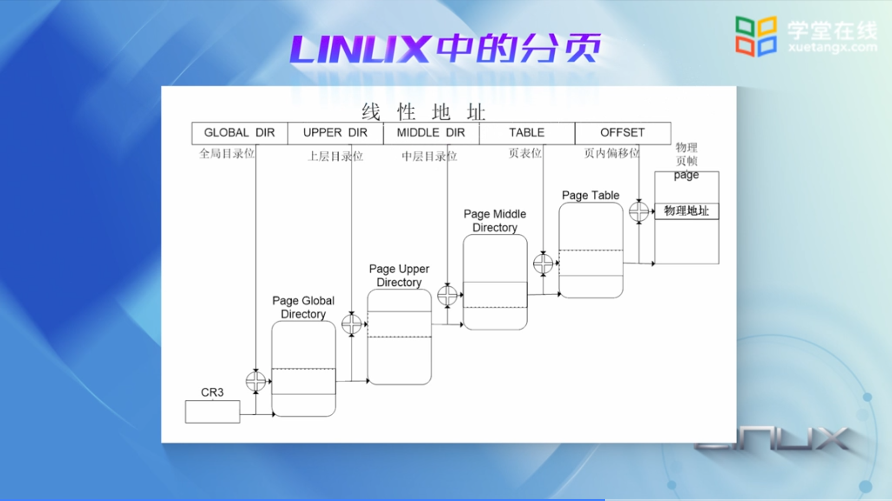

## 内存管理之内存寻址


CR0 的 0 位(PE 位)主要用于启动保护模式

如果 PE 位的值为 1 的话，那么保护模式启动；如果为 0 的话，则在实模式下运行

CR0 的 31  位(PG 位)表示芯片上的分页部件是被允许工作


## 保护模式下的段机制

### 程序的编译、链接和装载

```bash
gcc -S hello.c -o hello.s  # 编译
gcc -c hello.s -o hello.o  # 汇编
gcc hello.c -o a.out       # 链接
./a.out                    # 装载并执行
objdump -d a.out           # 反汇编
```

### 保护模式下的寻址

CPU 要访问的是虚地址


MMU 把虚地址转换成物理地址送给存储器

### MMU 的地址转换


### 段描述符表 -- 段表

段号描述的是虚拟地址空间段的编号

基地址是线性地址空间段的起始地址

段描述符表中的每一个表项叫做段描述符


### 段描述符 -- 描述段的结构


### 保护模式下段寄存器中存放什么


这里的段寄存器也叫选择符，即从描述符表中选择某个段

存放索引，也就是段号，最高的 13 位放的是索引

最低的 2 位放的是请求者的特权级，RPL 表示请求者的特权级（Requestor Privilege Level）

剩下的那一列 TI（Table Index）放的是表的索引，用于表示这个段表是在全局描述符表还是在局部描述符表里

### 保护模式下的特权级

0 表示高特权级，对应内核态；3 表示低特权级，对应用户态

高特权级可以访问低特权级，低特权级不能随意访问高特权级

### 保护模式下其他的描述符表简介

全局描述符表 GDT（Global Descriptor Table）

中断描述符表 IDT（Interrupt Descriptor Table）

局部描述符表 LDT（Local Descriptor Table）

为了加快对这些表的访问，Intel 设计了专门的寄存器，以存放这些表的基地址及表的长度界限，这些寄存器只供操作系统使用

## Linux 中的段

保护模式规定段是必选项，页是可选项

但是像 RISC 机器主要是以分页为主的，那么 Linxu 内核在设计代码的时候就要绕过段机制

**线性地址 = 段的起始地址 + 偏移量**

所以当我们将段的起始地址赋为 0 的时候，线性地址就等于偏移量，这样就可以绕过段机制了

---

Linux 在启动过程中设置了段寄存器的值和全局描述符表 GDT 的内容，内核代码中可以这样定义段：

```c
#define __KERNEL_CS 0x10  /* 内核代码段，index=2，TI=0,RPL=0 */
#define __KERNEL_DS 0x18  /* 内核数据段，index=3，TI=0,RPL=0 */
#define __UESR_CS   0x23  /* 用户代码段，index=4，TI=0,RPL=3 */
#define __UESR_DS   0x2B  /* 用户数据段，index=5，TI=0,RPL=3 */
```

### 保护模式寻址实例

```assembly
.set PROT_MODE_CSEG, 0x8         # 内核代码段选择子
.set PROT_MODE_DSEG, 0x10        # 内核数据段选择子
.set CR0_PE_ON,      0x1         # 保护模式开启的标志

/* lgdt 指令将全局描述符表的的地址以及表的长度装入到全局描述符表寄存器中 */
lgdt    gdtdesc

  /* 开启保护模式，之后将以保护模式的寻址模式进行地址的转换 */
  movl    %cr0, %eax        # 把控制寄存器 cr0 加载到 eax 中
  orl     $CR0_PE_ON, %eax  # 将 eax 中的第 0 位设置为 1
  movl    %eax, %cr0        # 将 eax 中的值装入 cr0 中
  
  # Jump to next instruction, but in 32-bit code segment.
  # Switches processor into 32-bit mode.
  # 实模式跳转到保护模式
  # $PROT_MODE_CSEG 是段选择子，值为 0x8
  # $protcseg 是偏移地址，因为段基址为 0，所以最终得到的物理地址就是偏移地址
  ljmp    $PROT_MODE_CSEG, $protcseg

protcseg:
  movw    0x10, %ax
  movw    %ax,  %dx
  movw    0xf0000000, %ebx
  movw    0x20(%ebx), %eax
 
/* 全局描述符表 */
gdt:
  SEG_NULL                           # null seg
  SEG(STA_X|STA_R, 0x0, 0xffffffff)  # code seg(代码段描述符)
  SEG(STA_W, 0x0, 0xffffffff)        # data seg(数据段描述符)
 
/* 全局描述符表对应的描述符：0x17 为表的长度，gdt 为表的物理地址 */
gdtdesc:
  .word   0x17                            # sizeof(gdt) - 1
  .long   gdt                             # address gdt
```


## 保护模式的分页机制

### 分页机制的引入


### 分页机制中的页


页表是一种映射机制，存放的是虚拟地址空间与物理地址空间的映射关系

### 两级页表

在一级页表中，因为每个页表最大就可以占用 4MB 的空间，而且还必须是连续的，这就为内存的分配带来了困难


### 两级页表的地址转换过程


第一步我们用最高 10 位（写有偏移量字样的 31 ~ 22 位）作为页目录项的索引，将它乘以 4（4 表示每一个页表项占 4 个字节）

然后与 CR3 中的**页目录的起始地址**相加，这样我们就获得相应目录项在内存的地址

第二步我们从这个地址就开始读取 32 位的页目录项，取出其最高的 20 位，然后再给最低的 12 位补零，就形成**页表在内存的起始地址**

第三步我们用中间的 10 位作为页表中页表项的索引，依然将它乘以 4 再与**页表的起始地址**相加，获得相应页表项在内存的地址

最后一步从这个地址开始读取 32 位的页表项，取出它高 20 位，再将线性地址的第 11 到 0 位放在低 12 位

最终形成 32 位的页面物理地址

### 页面高速缓存


命中就不经过两级页表（大约有 90% 的机率命中）；未命中就经过两级页表

### Linux 中的分页



Linux 中主要采用分页机制来实现虚拟存储器的管理，这么说的原因有如下两点：

1. Linux 巧妙的绕过了段机制

2. Linux 设计的目标之一就是具有可移植性，但是很多 CPU 不支持段

    为了保持可移植性，Linux 采用了四级分页模式，为此定义了四种类型的页表

第一级叫页总目录 PGD（Page Global Dictionary）

第二级叫页上级目录 PUD（Page Upper Dictionary）

第三级叫页中间目录 PMD（Page Middle Dictionary）

第四级叫页表 PT（Page Table）

### 分页初始化举例

```c
#define NR_PGT                     0X4     // 页表的数量
#define PGD_BASE  (unsigned int *) 0x1000  // 页目录的基地址
#define PAGE_OFFSET (unsigned int) 0X2000  // 页目录的偏移量
/* 页表属性的定义 */
#define PTE_PRE                    0X01
#define PTE_RW                     0X02
#define PTE_USR                    0X04

void page_init() {
    int pages = NR_PGT;
    unsigned int page_offset = PAGE_OFFSET;
    unsigned int *pgd = PAGE_BASE;  // 页目录位于物理内存的第二个页框内
    unsigned int phy_add = 0x0000;  // 在物理地址的最低端建立页机制所需要的表格
    // 页表从物理内存的第三个页框处开始，物理内存的头 8kb 没有用过页表映射
    unsigned int *pgt_entry = (unsigned int *)0x2000;
    while(page--) {
        *pgd++ = page_offset | PTE_USR | PTE_RW | PTE_PRE;
        page_offset += 0x1000;
    }
    pgd = PGD_BASE;
    // 在页表中填写页到物理地址的映射关系，映射到了4mb 大小的物理内存
    while(phy_add < 0x1000000) {
        *pgt_entry++ = phy_add | PTE_USR | PTE_RW | PTE_PRE;
        phy_add += 0x1000;
    }
    
    _asm_ _volatile_("movl %0, %%eax"
                     "movl %%cr0, %%eax"
                     "orl $0x80000000, %%eax"
                     "movl %%eax, %%cr0;"
                     ::"r"(pgd):"memory","%eax")
}
```