### 地址空间定义

**物理地址空间 -- 硬件支持的地址空间**

起始地址 0，直到 MAX~sys~

**逻辑地址空间 -- 在 CPU 运行的进程看到的地址**

起始地址 0，直到 MAX~prog~

### 地址生成过程

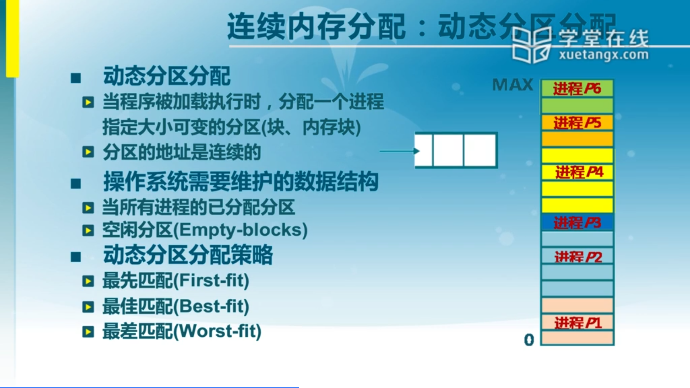

### 连续内存分配和内存碎片

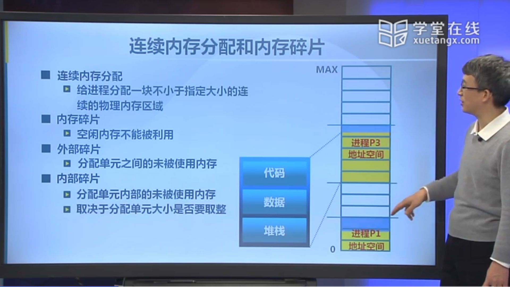

### 最先匹配策略

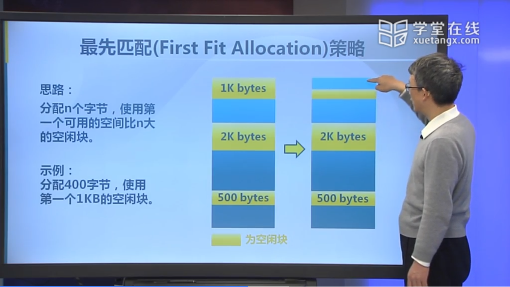

### 最佳匹配策略

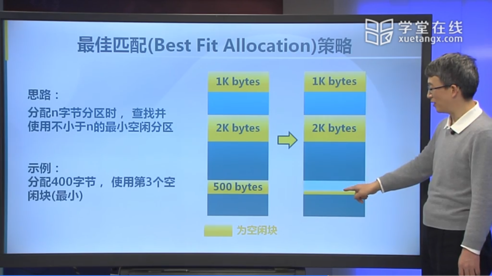

### 最差匹配策略

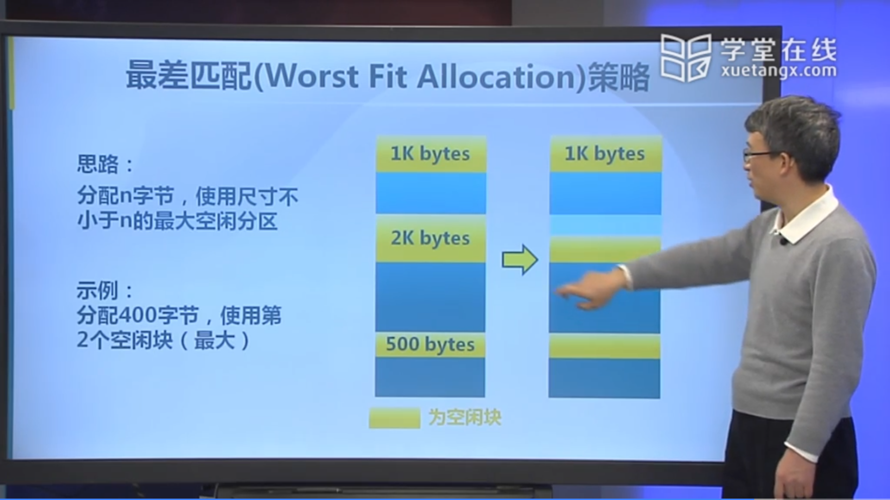

### 碎片整理：紧凑

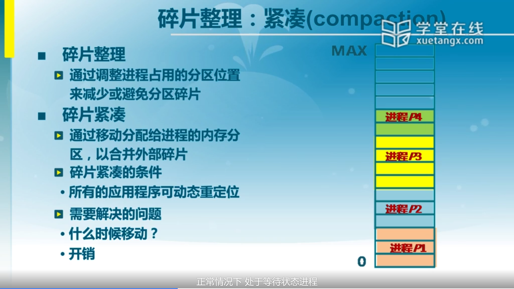

### 碎片整理：分区对换

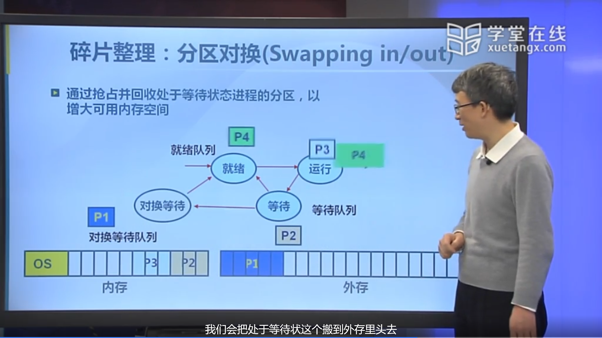

### 伙伴系统

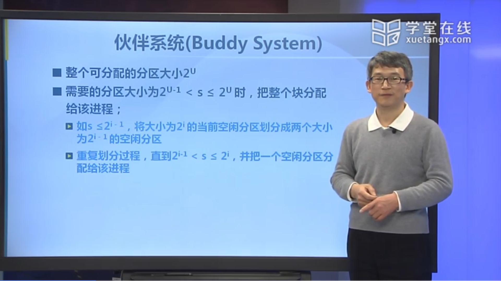

### 伙伴系统的实现

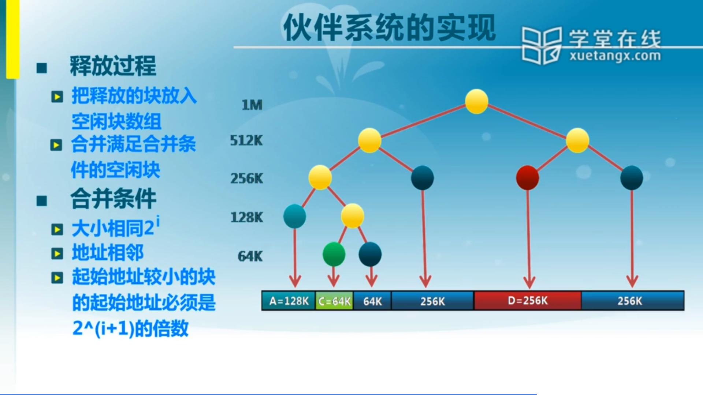

### 伙伴系统中的内存分配

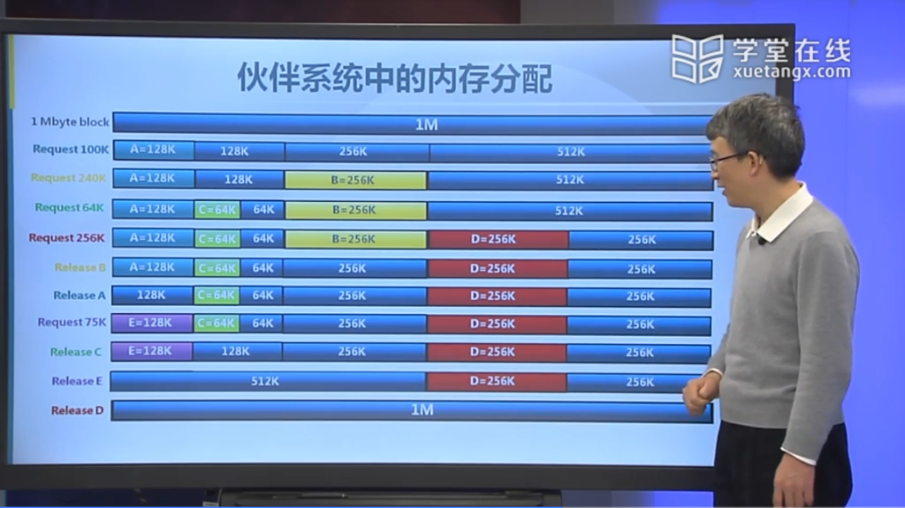

### ucore 中的物理内存管理

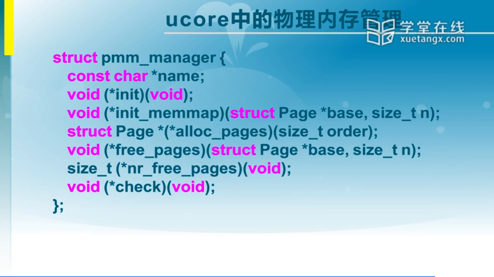

### ucore 中的伙伴系统实现

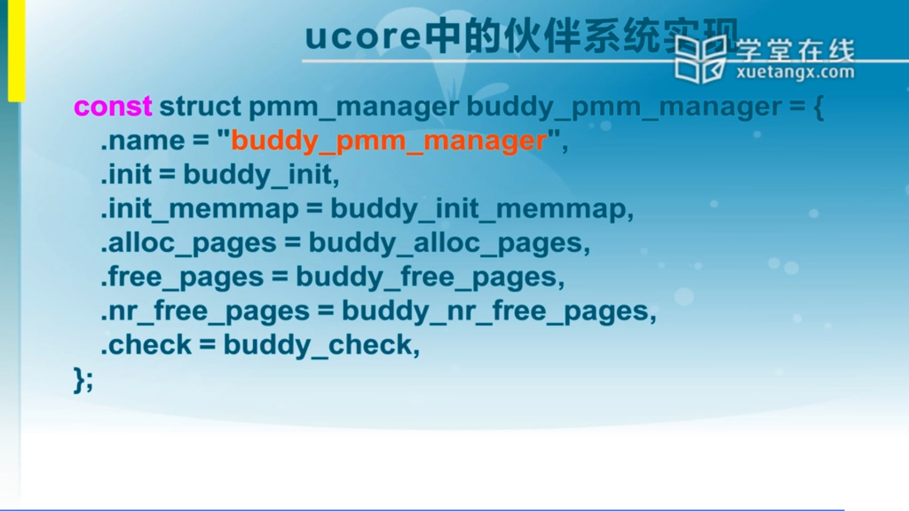