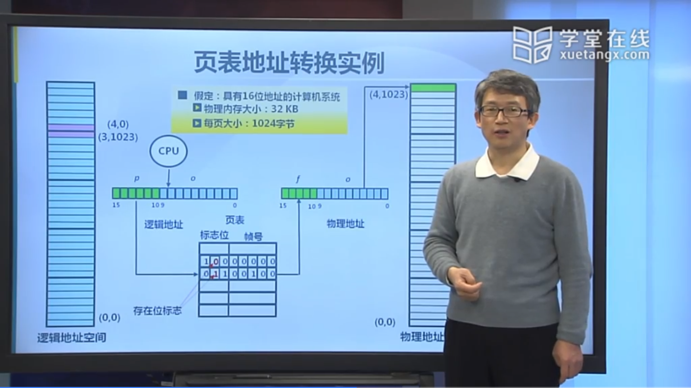
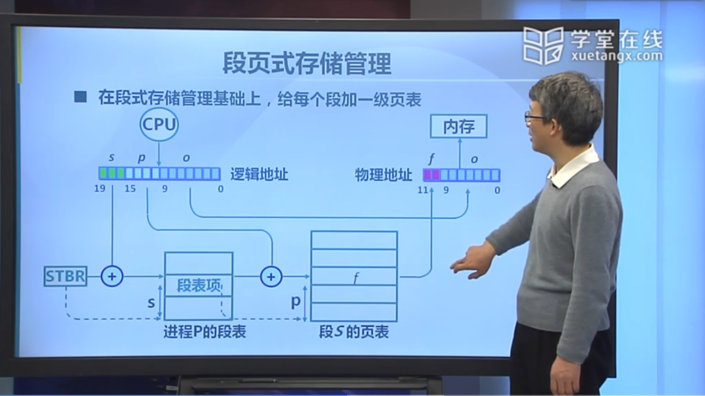

## 非连续内存分配的需求背景

### 非连续内存分配的实现

- 非连续分配需要解决的问题
    - 如何实现虚拟地址和物理地址的转换
        - 软件实现（灵活，开销大）
        - 硬件实现（够用，开销小）
- 非连续分配的硬件辅助机制
    - 如何选择非连续分配中的内存分块大小
        - 段式存储管理（segmentation）
        - 页式存储管理（paging）

段式存储分的块比较大，它以一个段作为一个基本的单位

在分配的时候，这一个段的内容必须在物理内存里是连续的，不同段之间是可以放到不同地方的

页式存储分的块更小，这个块叫做页

在分配的时候就是以页为单位进行分配，页与页之间式不连续的

## 段式存储管理

### 段访问机制

### 段访问的硬件实现

## 页式存储管理

页帧（帧，物理页面，Frame，Page Frame）

- 把物理地址空间划分为大小相同的基本分配单位
- 2 的 n 此法，如 512，4096，8192

页面（页、逻辑页面，Page）

- 把逻辑地址空间也划分为相同大小的基本分配单位
- 帧和页的大小必须是相同的

页面到页帧

- 逻辑地址到物理地址的转换
- 页表
- MMU/TLB

### 帧（Frame）

S 是帧的位数

### 基于页帧的物理地址计算实例

### 页（Page）

页内偏移的长度和页的大小是一致的，页内的偏移和帧内的偏移它俩是一样的

页号和帧号通常情况下是不一样的，因为逻辑地址空间的页号是连续的，到对应的帧号就不一定是相邻的了

S 位对应着它有 2 的 s 次方个字节为一页

**虚拟地址 = p * 2 ^s^ + o**，即 p 左移 S 位后加 o

### 页式存储中的地址映射

对应的关系的构建由页表来完成

### 页表

页表基址规定了这个页表的起始地址

看到页表我大致也明白了前面的一些操作，对于页表来说：

p 是一个长度单位，p 的下边框所指的下标减去 1 内的地址里存着帧号 f，且页表总长度减去 p 后得到的就是 o

f 是物理地址里的长度单位（页表内帧号），作用类似于 p

对于 o 来说，页内偏移（逻辑地址）和帧内偏移（物理地址）是一样的，也就是说 S 都是一样的

那么我们可以得到 **逻辑地址 = f * 2 ^s^ + o**，即 f 左移 S 位后加 o

## 页表

### 页表结构

存在位是指对于一个逻辑页号，是否有其相应的物理页面（物理帧）。如果有，存在位的值就是 1；反之就是 0

修改位是说它对应的这个页面里面的内容是否修改了

引用位是指这个页面在过去一段时间里是否有过对它的引用，即是否访问过这个页面里的某一个存储单元

### 页表地址转换实例

### 页式存储管理机制的性能问题

- 内存访问性能问题
    - 访问一个内存单元需要 2 次访问
    - 第一次访问：获取页表项
    - 第二次访问：访问数据
- 页表大小问题
    - 页表可能非常大
    - 64 位机器如果每页 1024 字节，那么一个页表的大小会是多少？
- 如何处理
    - 缓存（Caching）
    - 间接（Indirection）访问

### 快表（Translation Look-aside Buffer, TLB）

本质是进行多次访问，但是快表是在 CPU 中运行的所以会很快

但是因为快表的容量很小，不能反映出所有的页表，就会出现未命中的情况

### 多级页表

每一级页表的基地址都有对应的寄存器存储

### 二级页表实例

### 大地址空间问题

- 对于大地址空间（64-bits）系统，多级页表变得**繁琐**
    - 比如：5 级页表
    - 逻辑（虚拟）地址空间增长速度快于物理地址空间
- 页寄存器和反置页面的思路
    - 不让页表与逻辑地址空间的大小相对应
    - 让页表与物理地址空间的大小相对应

### 页寄存器（Page Registers）

- 没饿过帧与一个页寄存器（Page Registers）关联，寄存器内容包括：
    - 使用位（Residence bit）：此帧是否被进程占用
    - 占用页号（Occupier）：对应的页号 p
    - 保护位（Protection bits）
- 页寄存器示例
    - 物理内存大小：4096 * 4096 = 4 K * 4 KB = 16 MB
    - 页面大小：4096 bytes = 4 KB
    - 页帧数：4096 = 4 K
    - 页寄存器使用的空间（假设每个页寄存器占 8 字节）：
        - 8 * 4096 = 32 Kbytes
    - 页寄存器带来的额外开销：
        - 32 K/16 M = 0.2%（大约）
    - 虚拟内存大小：任意

### 页寄存器方案的特征

- 优点：
    - 页表大小相对于物理内存而言很小
    - 页表大小与逻辑地址空间大小无关
- 缺点：
    - 页表信息对调后，需要依据帧号来找到页号
    - 在页寄存器中搜索逻辑地址中的页号比较困难

### 页寄存器中的地址转换

- CPU 生成的逻辑地址如何找对应的物理地址？
    - 对逻辑地址进行 Hash 映射，以减少搜索范围
    - 需要解决可能的冲突
- 用快表缓存页表项后的页寄存器搜索步骤
    - 对逻辑地址进行 Hash 变换
    - 在快表中查找对应页表项
    - 有冲突时遍历冲突项链表
    - 查找失败时，产生异常

- 快表的限制
    - 快表的容量限制
    - 快表的功耗限制（StrongARM 上快表功耗占 27%）

### 反置页表

反置页表和页寄存器的做法的区别是在于反置页表把进程 ID 也考虑进来了，两者的做法基本是一样的

它们都是需要先进行 Hash，不同的地方是反置页表把进程标识也加在里头一块做 Hash

Hash 完的结果也可能会有冲突，Hash 完的结果是以页帧号来进行排序的

需要到相应的页表项里去核对 Hash 之前的结果和之后里头的进程 ID 和逻辑号是否一致

如果一致，那么这就是我要找的那一项，就可以得到相应的物理页号了

如果不一样，就会产生冲突，见下面↓↓↓

### 反置页表的 Hash 冲突

## 段页式存储管理的需求

- 段式存储在内存保护方面有优势，页式存储在内存利用和优化转移到后备存储方面有优势
- 短时存储、页式村塾能否结合？

### 段页式存储管理

在段式存储管理基础上给每一个段加一级页表（也可以是多级页表）

首先段号由进程的段基址找到相应的段表基址，再找到相应的段表项

段表项里由相应段的段的长度和段基址，再得到相应段的页表的基址

之后再加上页号就可以得到相应的页表项，页表项里就有对应的物理页的页帧号

物理页帧号和其对应的页内偏移加在一起就可以访问到实际的物理存储单元了

### 段页式存储管理中的内存共享

