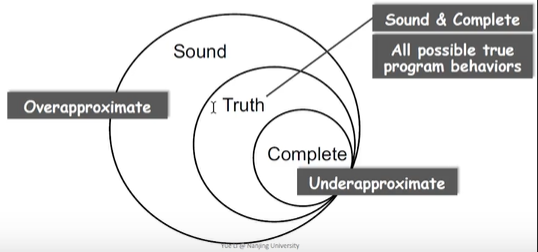
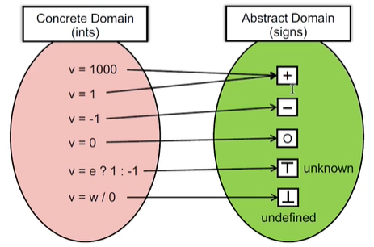
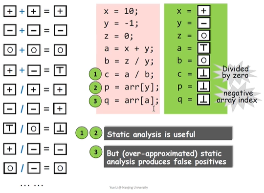
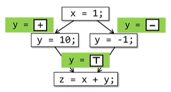

## PL and Static Analysis

PL（Programme languages）

- Theory
    - Language design
    - Type system
    - Semantics and logics
    - ... ...
- Environment
    - Compliers
    - Runtime system
    - ... ...
- Application
    - Program analysis
    - Program verification
    - Program synthesis
    - ... ...

## Why We Learn Static Analysis？

- Program Reliability
    - NULL pointer dereference
    - Memory leak
    - ... ...
- Program Security
    - Private information leak
    - Injection attack
    - ... ...
- Complier Optimization
    - Dead code elimination
    - Code motion
    - ... ...

## Rice's Theorem

> Any **non-trivial** property of the behavior programes in a r.e. language is **undecidable**.

r.e. (recursively enumerable) = recognizable by a Turing-machine

- trivial 就是简单的，non-trivial 就是重要的
- recursively enumerable（递归可枚举）
- 该话的意思大致是：如果这个程序是由递归可枚举的现代正常的语言写的程序，它的一些 non-trivial 的 property 都是不可判断的


> A property is trivial if either it is not satisfied by any r.e. language, or if it is satisfied by all r.e. languages; otherwise it is **non-trivial**.

&nbsp;&nbsp;&nbsp;&nbsp;&nbsp;**non-trivial** properties

~= **interesting** properties

~= the properties related with **run-time behaviors** of programs

- **Perfect** static analysis（这是不存在的）

    - 含义：存在这样一种方法，它能够去判断一个程序是否能满足 **non-trivial properties**

        &nbsp;&nbsp;&nbsp;&nbsp;&nbsp;&nbsp;&nbsp;&nbsp;&nbsp;&nbsp;&nbsp;&nbsp;比如说判断有没有空指针，那么准确地告诉你有还是没有是不存在的

    - Sound（误报）
    - Complete（漏报）

    

- **Useful** static analysis

    - Compromise soundness（<font color='red'>false negatives</font>）
    - Compromise completeness（<font color='green'>false positives</font>）

- Mostly compromising completeness:

    **Sound** but **not fully-precise** static analysis

    大多数静态分析都是妥协漏报，支持误报但不会很精确

## Necessity of Soundness

- Soundness is critical to a collection of important（static-analysis）

    applications such as compiler optimization and program verfication

- Soundness is also **preferable** to other (static-analysis) applications

    for which soundness is not demanded, e.g., bug detection, as better

    soundness implies more bugs could be found

## Static Analysis

### Bird's Eye View

```ruby
  if(input)
    x = 1;
  else
    x = 0;
→ x = ?
```

1. When input is true, x = 1

    When input is false, x = 0

    `Sound, precise, expensive` 这里体现在记录了 input 的值

2. x = 1 or x = 0

    `Sound, imprecise, cheap`，只显示了 x 的值，虽然不比上面的精确，但是更快更简单

- Static Analysis
    - ensure (or get close to) **soundness**, while making good trade-offs between analysis **precision** and analysis **speed**
- Two Words to conclude Static Analysis
    - Abstraction
    - Over-approximation

### Abstraction

Determine the sign (+, -, or 0) of all the variables of a given program



### Over-approximation

#### Transfer functions

- In static analysis, transfer functions define how to evaluate

    different program statements on abstract values

- Transfer functions are defined according to "analysis problem"

    and the "semantics" of different program statements



#### Control flows

```ruby
x = 1;
if(input)
  y = 10;
else
  y = -1;
z = x + y;
```



As it's impossible to enumerate all paths in practice, flow merging (as a way of over-approximation)

is taken for granted in most static analysis.

## Teaching Plan (Tentative)

1. Introduction
2. Inter mediate Respresentation
3. Data Flow Analysis -- Applilcations
4. Data Flow Analysis -- Foundations (Ⅰ)
5. Data Flow Analysis -- Foundations (Ⅱ)
6. Inter-procedural Analysis
7. CFL-Reachability and IFDS
8. Soundness and Soundiness
9. Pointer Analysis -- Foundations (Ⅰ)
10. Pointer Analysis -- Foundations (Ⅱ)
11. Pointer Analysis -- Context Sensitivity
12. Modern Pointer Analysis
13. Static Analysis for Security
14. Datalog-Based Analysis
15. Abstract Interpretation
16. Course Summary

## Coding Assignments (Tentative)

- Assignment 1: **Constant Propagation** (CP, 12 points)
    - Statically compute and propagte constant values in program
    - Intra-procedural analysis
- Assignment 2: **Dead code Elimination**  (DCE, 12 points)
    - Based on constant propagation, eliminate dead code in program
    - b = true; if (b) { ... } else { /* dead code */ }
- Assignment 3: **Class Hierarchy Analysis** (CHA, 8 points)
    - Build a call graph via class hierarchy analysis
    - Enable inter-procedural constant propagation
- Assignment 4: **Pointer Analysis** (PTA, 12 points)
    - Build a call graph via pointer analysis (more precise than CHA)
    - Enable more precise inter-provrdural constant propagation
- Assignment 5: **Context-Sensitive Pointer Analysis** (CSPTA, 6 points)
    - Build a call graph via C.S. pointer analysis (more precise than PTA)
    - Enable more precise inter-procedural constant propagation